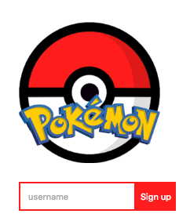

# meteor-multiplayer-game

Tutorial Part1:

Meteor is a platform or somebody describe it is a framework that bundling nice technology together and allow developer create fullstack realtime app.
Some of the benefits people describe you can find from here: https://www.sitepoint.com/7-reasons-develop-next-web-app-meteor/  

The reason why I choose meteor as it is fast to prototype a multiplayer-game without many understanding of backend techs, so you can demo your idea a lot more quickly compare to convention ways.  
To demostrate this point,
I am going to create a realtime chat and have multiple users to move arround in the playground with phaser and meteor.  

To install meteor, please follow this link `https://www.meteor.com/install`

Meteor has divide it's folder with client, server and public when you installed, which direct explain how you should structure your code.
Let's create a simple page that user can sign up the game chat with other users.

Firstly, you will need to setup two Mango db database, one for message inside the game, one to restore player data.

```
-> common/db.js

import { Mongo } from 'meteor/mongo';

Messages = new Mongo.Collection('messages');
Players = new Mongo.Collection('players');
```

Now we can create a simple html template for user to signup join the game.
As Pokeman is so popular, that's borrow some of its characters and icons.

```
-> client/main.html

<head>
	<title>multi player name</title>
</head>

<body>
 <div class="right">
	
	{{> loginStatus}}
	{{> chat}}
  </div>
</body>

<!-- Game singup area -->
<template name="loginStatus">
	{{#if signedUp }}
	  {{ username }} has sign up for the current game
	{{else}}
	<form>
		<input type="text" id="username" placeholder="username" />
		<button> Sign up </button>
	</form>
	{{/if}}
</template>
```
Also, you will need to write some helper function to make the event works when you sign up for the game.  
We use Session to restore temporary data in each client in order to identify user info later on.  
We also insert users data to the Players table when user click sign up button, and it will provide us a unique playerId.  
Any variable we define without setup a type, it will be come a global var that you can access in both backend and frontend.  

```
-> client/templates.js

import { GAME_WIDTH, GAME_HEIGHT } from '../common/const';
import './main.html';
import { Session } from 'meteor/session';
let randx = Math.floor((Math.random() * GAME_WIDTH) + 1);
let randy = Math.floor((Math.random() * GAME_HEIGHT) + 1);

if (Meteor.isClient) {
    Template.loginStatus.events({
        'click button': (evt, template) => {
            evt.preventDefault();
            let username = template.find('#username').value;

            playerId = Players.insert({
                name: username,
                sprite: 'pikachu',
                position: {x: randx, y: randy},
                time: Date.now()
            });

            Session.set('playerId', playerId);
        }
    });

    Template.loginStatus.helpers({
        'signedUp': function(){
            if(Session.get('playerId')){
                return true;
            }
        },
        'username': function(){
            return player[Session.get('playerId')].name;
        }
    });
```
Now you have a signup area for the game.  



Add Chat template, this will looping all the message information and send to client.

```
-> client/main.html

<template name="chat">
	{{#if signedUp}}
		<p>Messages:
			<input type=text" id="message" />
		</p>

		{{#each messages}}
		<p class="message">
			<strong class="name">{{name}}:</strong> {{message}}<br/>
			<span class="remove" id="chatID" data-id={{_id}} >x</span>
		</p>
		{{/each}}
	{{/if}}
</template>
```

Add chat functions to insert Message data with username and provide the function that you can remove dialogs.

```
-> client/template.js
    Template.chat.helpers({
        'signedUp': function(){
            if(Session.get('playerId')){
                return true;
            }
        },
        'messages': function() {
            return Messages.find({}, { sort: { time: -1, limit:10 }});
        }
    });

    Template.chat.events({
        'keydown input#message' : function (event) {
            if (event.which == 13) {
                var username = player[Session.get('playerId')].name;
                var message = document.getElementById('message');
                if (message.value != '') {
                    Messages.insert({
                        name: username,
                        message: message.value,
                        time: Date.now()
                    });

                    document.getElementById('message').value = '';
                    message.value = '';
                }
            }
        },
        'click #chatID': function (event){
            var chatID = event.target.getAttribute('data-id');
            Messages.remove(chatID);
        }
    });
```


Now we have a simple chat system, let's add the game in.  
We use Meteor.startup function to initial the game, currently, we only add one character image and background.

```
-> client/game.js
    Meteor.startup(function () {
        game = new Phaser.Game(GAME_WIDTH, GAME_HEIGHT, Phaser.AUTO, 'game', {
            preload: preload,
            create: create,
            update: update
        });
    });

    function preload(){
        game.load.image('pikachu', '/pikachu.gif');
        game.load.image('background', '/backgrounds.png');
    }

    function create() {
        game.add.sprite(0, 0, 'background');
        player = {};
        move = game.input.keyboard.createCursorKeys();
        tracking();
    }
    function update(){
        characterMove();
    }
```
As you can see, there are two methods haven't been called and they are the functions you can see how players interact with each other. :)  
characterMove() -> we just need to define the user's move and udpate the data position to backend if they are not idle.
```
function characterMove(){
    let isActive = false;

    if(move.left.isDown){
        player[playerId].x -= speed;
        isActive = true;
    }

    if (move.right.isDown){
        player[playerId].x += speed;
        isActive = true;
    }

    if(move.up.isDown){
        player[playerId].y -= speed;
        isActive = true;
    }

    if (move.down.isDown){
        player[playerId].y += speed;
        isActive = true;
    }

    if(isActive){
        Players.update( playerId,
            { position:
                { x : player[playerId].x,
                  y: player[playerId].y}
            }
        );
    }
}
```
in the tracking function, you basically need to mirror the same changes from Players table to the client,
Therefore, you will be able to see other users and interact with them in realtime.

```
function onPlayerAdded(newPlayer){
    let x = newPlayer.position.x;
    let y = newPlayer.position.y
    let image = game.add.sprite(x, y, 'pikachu');
    let name = game.add.text((x + 30), (y + 100), newPlayer.name,
        {fill:"#fff", align: "center", font: "20px Arial"});
    let id = newPlayer._id;
    player[id] = game.add.group();
    player[id].add(image);
    player[id].add(name);
    player[id].name = newPlayer.name;
}

function onPlayerMoved(playerMoved){
    let id = playerMoved._id;
    player[id].position.x = playerMoved.position.x;
    player[id].position.y = playerMoved.position.y;
}

function onPlayerRemoved(playerRemoved){
    let id = playerRemoved._id;
    player[id].destroy();
}

// reset the user if tab closed
window.onbeforeunload = function(){
    Players.remove(playerId);
    Messages.remove({name: player[playerId].name});
};
```

